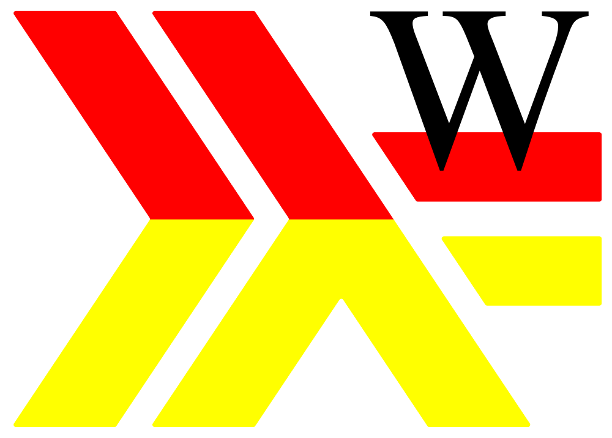
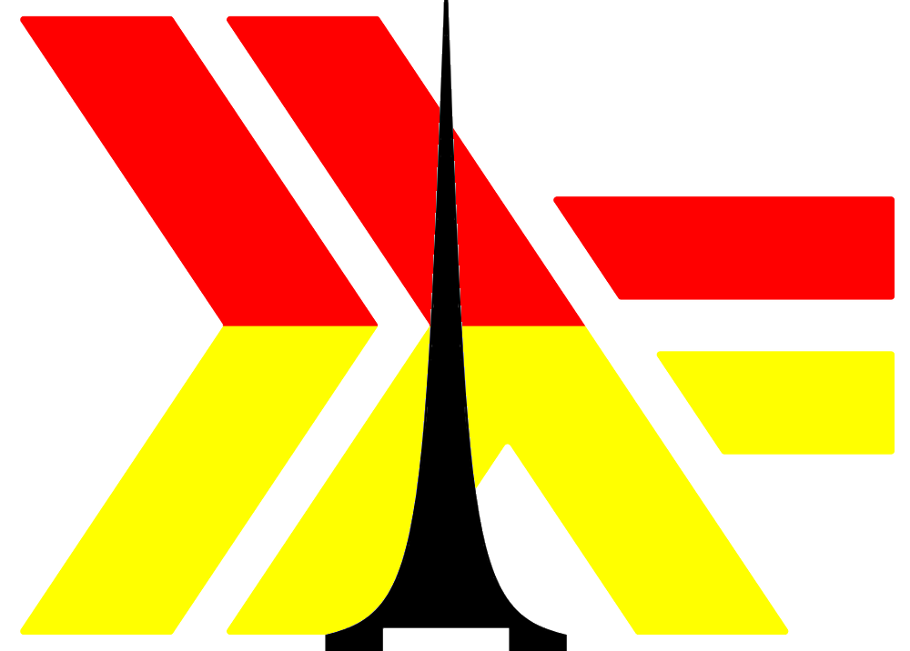
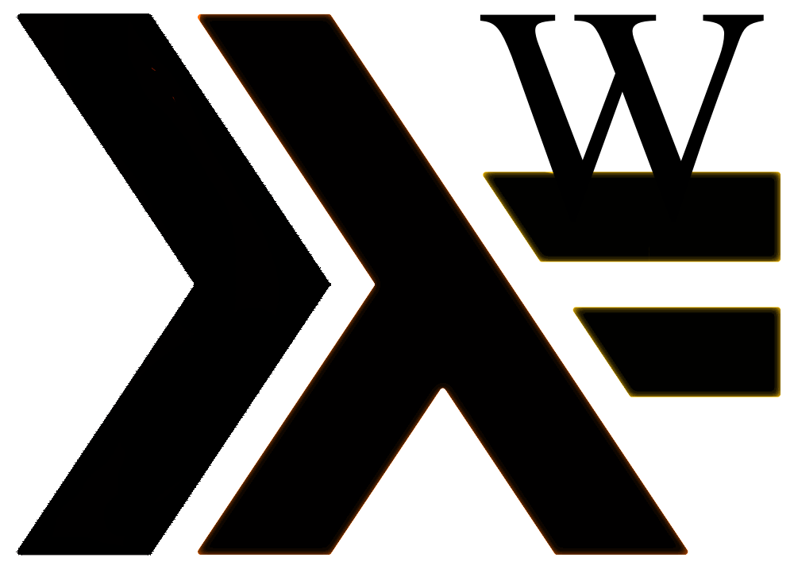

Functional**Programming**Wroclaw**(https://www.meetup.com/pl-PL/Functional-Programming-Wroclaw)**resources
======================================================================================================

https://wiki.haskell.org/Haskell_logos
https://wiki.haskell.org/TW-Logo-Haskell

**#1**

**#2**

**#3**

**#4**

**#5**

**#6**

**#7**

